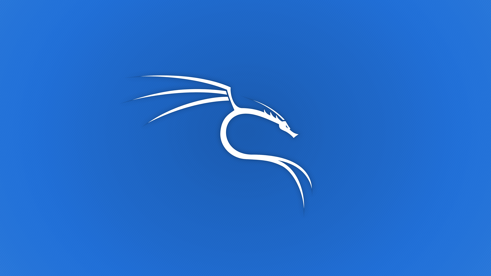
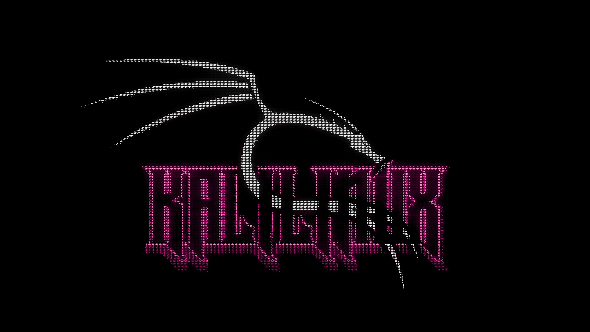

<!-- BANNER -->
  <h1>Recolored Kali Wallpapers 2025</h1>
<h1 align="center">
  
   
  
This project will added some colours and extra wallpapers

  
Credit to <a href="https://github.com/owerdogan/wallpapers-for-kali/">owerdogan</a>

</h1>

Kali Red(Extras)

 
  

Kali Green(Extras)

 

Kali Cyan

 

Kali Yellow(Extras)

 

Kali Blue(New)

 

Kali Purple(New)

 

Kali Pink(New)

 

<!-- LICENSE -->
<h2>License</h2>

Distributed under the MIT License. See `LICENSE` for more information
